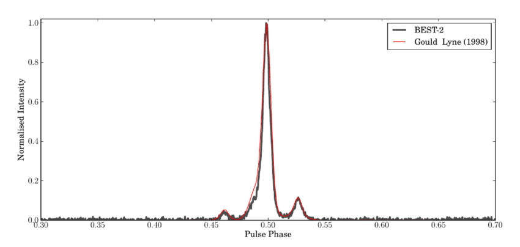

```{r setup, include=FALSE}
knitr::opts_chunk$set(echo = TRUE)
if(!require(tidyverse)) install.packages("tidyverse", repos = "http://cran.us.r-project.org")
if(!require(caret)) install.packages("caret", repos = "http://cran.us.r-project.org")
if(!require(data.table)) install.packages("data.table", repos = "http://cran.us.r-project.org")
if(!require(readr)) install.packages("readr", repos = "http://cran.us.r-project.org")
if(!require(ROCR)) install.packages("ROCR", repos = "http://cran.us.r-project.org")
if(!require(boot)) install.packages("boot", repos = "http://cran.us.r-project.org")
if(!require(xgboost)) install.packages("xgboost", repos = "http://cran.us.r-project.org")
if(!require(ggplot2)) install.packages("ggplot2", repos = "http://cran.us.r-project.org")
if(!require(png)) install.packages("png", repos = "http://cran.us.r-project.org")
```

## Introduction

Pulsars have fascinated the space science community ever since their discovery in 1967 by Jocelyn Bell; a Cambridge University graduate student at the time. Bell was making observations of the universe in radio wavelength, with her advisor Dr. Anthony Hewish, when they discovered consistently repeating signals of extra-terrestrial origin. With no plausible explanation, Bell and Hewish dubbed it as Little Green Men (LGM). Later, they found similar kind of signals emanating from different regions of space and hence ruled out that these signals could be from intelligent life forms of extra-terrestrial origins. They named it as pulsars when they first submitted their research paper to a magazine on these  signals. A year later Thomas Gold identified these signals are emitted by fast rotating neutron stars. While neutron stars had been theorized to exist decades earlier, they were not detected until the pulsars were detected.

```{r  out.height="40%", fig.align='center', echo=FALSE}
knitr::include_graphics('pulsar_nrao.jpg') 
```


\begin{center} 
Image Credit: National Radio Astronomy Observatory
\end{center}


Pulsars emit sweeping radio signals similar to a light house emitting light. Hence, they are detected on earth as the beam of waves emitted sweep through the planet. Since pulsars rotate, these emission beams sweep through our planet periodically.  Since radars on earth emit radio signals at consistent intervals to identify obstacles similar to a pulsar, there can be many spurious sources of radio signals. The purpose of this project is to study radio signals through machine learning algorithms and identify if the source could be a pulsar or not. This project is imagined as the first step in identifying a pulsar. The spurious sources of radio signals will be filtered out as much as possible and a final list of potential pulsar signals will be derived so that a deeper analysis on these can be done subsequently. 

The dataset used in this project is provided by The High Time Resolution Universe Pulsar Survey. This survey, still in progress, began on November 2008 with the goal to survey the entire southern sky for potential pulsars. The dataset contain eight different features for each pulsar candidate. The dataset was downloaded from the UCI repository. More infomation on the dataset can be found in the link <https://archive.ics.uci.edu/ml/datasets/HTRU2>

## Analysis

The dataset contains potential pulsar candidates and eight different features for each candidate. The features are derived from the Integrated Pulse Profile and the DM-SNR curve of the candidate. Below is a basic explanation of these terms to the uninitiated.

### Integrated Pulse Profile

Each pulsar has a pulse profile, which is a radio frequency profile of the pulsar at a fixed frequency range. Hence, pulsars are generally identified based on the pulse profile. The pulse profile  name of the popular crab pulsar in its namesake nebula is PSR B0531+21. The below graph shows the integrated pulse profile of a pulsar PSR B0329+54.

```{r  out.width="100%", fig.align='center', echo=FALSE}
 
```

Pulsars emit radio signal blips that are detected by radio telescopes on earth. The duration between each signal could be in milliseconds to seconds. The signal from each blip is captured and plotted, with each signal super-imposed on top of the previous signal. The super-imposition of multiple signals from the pulsar provides an almost stable spectra of the pulsar signal that if further signals are plotted, they would be almost similar to the super-imposed spectra. This is called as **Folding**. This super-imposed spectra is called the Integrated Pulse Profile. The pulse profile shown in the previous figure is derived by super-imposing 200 readings on top of each.

### DM-SNR

A DM-SNR curve is a plot of the Dispersion Measure (DM) and Signal-to-Noise Ratio (SNR). A pulsar emits radio signal at multiple frequencies. When observing a pulsar signal, the higher frequencies reach the observer first followed by the lower frequencies. This is because as the radio signal travels through the Interstellar Medium (ISM), it could encounter several obstacles. If the signal is highly dispersed, it could mean the source is far away. It could also mean the source is near but the ISM through which it travelled is dense.

Signal-to-Noise Ratio is a measure of how good the signal is. Noise is basically the frequencies that do not belong to the actual source, rather that had been picked up from some other medium during the travel. The higher the SNR, the better is the signal.

The dataset contains 17,898 signals out of which 1.639 have been positively identified as pulsars. In this project this dataset  will be trained with various ML algorithms and tested to find out the better performing algorithm. The algorithms will be tuned to be more sensitive to ensure as much true positives are identified, while restricting false positives.

```{r echo = FALSE, output = FALSE, warning = FALSE, cache=TRUE}
dl <- tempfile()
download.file("https://archive.ics.uci.edu/ml/machine-learning-databases/00372/HTRU2.zip", dl)
HTRU <- fread(text = gsub(",", "\t", readLines(unzip(dl, "HTRU_2.csv"))), 
                col.names = c("mean_ip","sd_ip","excess_kurt_ip","skew_ip","mean_dmsnr",
                              "sd_dmsnr","excess_kurt_dmsnr","skew_dmsnr","confirmed"))
```

Below is the summary of the dataset. 

```{r echo = FALSE}
summary(HTRU)
```

The columns are all of numeric class. The confirmed column has values 1 or 0 indicating whether it is a pulsar or not. The confirmed column was converted to factor from numeric type to simplify calculating the algorithm statistics. Below is a sample of the dataset after performing this action.

```{r echo = FALSE}
HTRU$confirmed <- as.factor(HTRU$confirmed)
head(HTRU, 8)
```

Exploratory data analysis was performed to understand the data. The features were plotted in a boxplot to understand their characteristics and their potential in distinctly identifying a pulsar.

```{r echo = FALSE, warning=FALSE}
HTRU %>% head(1000) %>% gather(reading, value, -confirmed) %>%
      mutate(pulsar = ifelse(confirmed == 1,"Yes","No")) %>%
      ggplot(aes(pulsar, value, fill = pulsar)) +
      scale_y_continuous(trans="log10") + 
      geom_boxplot() +
      facet_wrap(~reading, scales = "free")

```

The above plot indicates some of the features such as skew_ip and excess_kurt_ip have high potential to identify a pulsar. The below plot shows one such example.

```{r echo = FALSE, out.width="80%", fig.align='center'}
HTRU %>% head(1000) %>% 
  mutate(pulsar = ifelse(confirmed == 1,"Yes","No")) %>%
  ggplot(aes(skew_ip, excess_kurt_ip, color = pulsar)) + 
  xlab("Skewness of Integrated Pulse Profile") +
  ylab("Excess Kurtosis of Integrated Pulse Profile") +
  geom_point()
```

```{r echo = FALSE, output = FALSE, warning=FALSE}
set.seed(1, sample.kind = "Rounding")
test.index <- createDataPartition(y = HTRU$confirmed, times = 1, p = 0.1, list = FALSE)
HTRU.train <- HTRU[-test.index,]
HTRU.validation <- HTRU[test.index,]

set.seed(1, sample.kind = "Rounding")
train.index <- createDataPartition(y = HTRU.train$confirmed, times = 1, p = 0.1, list = FALSE)
HTRU.train.train <- HTRU.train[-train.index,]
HTRU.train.test <- HTRU.train[train.index,]
```

The HTRU dataset was divided into training and validation sets in the ratio of 9:1. The validation dataset was used to perform the prediction after finalizing the model. The train dataset was further divided into train and test datasets for performing model training and cross validation. Logistic Regression was performed on the train dataset as the first choice of algorithm with family paramter set to binomial. The model was tested on the test dataset.

```{r echo = FALSE, output = FALSE}
glm.train.fit <- glm(confirmed ~ ., data = HTRU.train.train, family = "binomial")
p_hat.train.glm <- predict(glm.train.fit, newdata = HTRU.train.test, type = "response")
```

The probability cutoff for the logistic regression model was set as the default 0.5 to understand the performance of the model. The default glm model resulted in an accuracy of 0.9801 with sensitivity of 0.8311 and specificity of 0.9952.

The default logistic regression algorithm had the capability to correctly classify 98% of the signals. The algorithm had classified 99.5% of the negatives as negatives, while it was able to identify 83% of the positives as positives. The high accuracy and specificity could be the result of high prevalence of negatives. The number of positive candidates in the original dataset is roughly 10% of the total candidates. A cross validation analysis was performed to understand the effect of cutoff in identifying more positive candidates. Cutoff values from 0 to 1 were used with increments of 0.05. The effect of the cutoff on harmonic mean (f-score), sensitivity and specificity were plotted.

```{r echo=FALSE, warning=FALSE, out.width="80%", fig.align='center'}
cutoff_seq.glm <- seq(0, 1, by = 0.05)
p_hat.glm.df <- data.frame()
for(p in cutoff_seq.glm){
  y_hat.train.glm <- ifelse(p_hat.train.glm > p, 1, 0) %>% factor
  conf_mat <- confusionMatrix(y_hat.train.glm,HTRU.train.test$confirmed, positive = "1")
  df_row <- data.frame(cutoff = p, Sens = conf_mat$byClass["Sensitivity"], Spec = conf_mat$byClass["Specificity"], 
                       fscore = 2* ((conf_mat$byClass["Sensitivity"]*conf_mat$byClass["Specificity"])/
                                      (conf_mat$byClass["Sensitivity"]+conf_mat$byClass["Specificity"])))
  p_hat.glm.df <- rbind(p_hat.glm.df,df_row)
}

p_hat.glm.df %>% gather(key = "Statistic", value = "Probability", -cutoff) %>%
    ggplot(aes(x = cutoff, y = Probability)) +
    geom_line(aes(color = Statistic,  linetype = Statistic)) +
    xlab("Cut Off") + 
    ylab("Class Factor") + 
    scale_x_continuous(breaks=seq(0,1,0.1)) +
    scale_y_continuous(breaks=seq(0,1,0.1))

prob.glm <- p_hat.glm.df[which(p_hat.glm.df$fscore == max(p_hat.glm.df$fscore)),]$cutoff
```

A visual inspection of the plot indicates that the f-score was highest at cutoff of around 0.1. For cutoffs higher than this value the f-score continues to drop along with sensitivity. The specificity is almost constant after this f-score. The highest f-score of 0.9518 was obtained at a cutoff of 0.1.

The cutoff obtained above was used to retrain the model. The model was used again to make predictions on the test dataset.

```{r echo = FALSE, output = FALSE, warning=FALSE}
y_hat.train.glm <- ifelse(p_hat.train.glm > prob.glm, 1, 0) %>% factor
conf_mat <- confusionMatrix(y_hat.train.glm,HTRU.train.test$confirmed, positive = "1")
```

The revised cutoff resulted in and accuracy of 0.9683 with sensitivity of 0.9324 and specificity of 0.9720. The sensitivity of the glm model increased after applying the cutoff derived from cross validation. The Receiver Operating Characteristic (ROC) curve was plotted to visually verify the model's ability to distinguish the classifiers.

```{r echo = FALSE, out.width = "80%", fig.align="center"}
pred.glm <- prediction(p_hat.train.glm, HTRU.train.test$confirmed)
perf.glm <- performance(pred.glm,"tpr","fpr")
plot(perf.glm, colorize = TRUE)
abline(a = 0, b = 1)
```


```{r echo = FALSE}
glm.auc <- performance(pred.glm,  measure  = "auc")@y.values[[1]]
model.results <- data.frame(Model = "glm", CutOff = prob.glm, Sensitivity = conf_mat$byClass["Sensitivity"], 
                            Accuracy = conf_mat$overall["Accuracy"], PPV = conf_mat$byClass["Pos Pred Value"],
                            AUC = glm.auc)
```

The above curve shows the model is able to make correct distinction of most of the candidates. The Area Under Curve (AUC) value of the revised glm model was 0.9806, which is very close to 1, indicating the model is able to classify the candidates to a great extent.

As it was mentioned previously, the prevalence of negative candidates is high in the dataset. Hence boosting was performed on the same dataset to verify if it improves the sensitivity derived from the glm model.The Extreme Gradient Boosting algorithm was used on the same datasets. Boosting algorithms have the capacity to boost weak classifiers into strong classifiers thereby improving the positive prediction power and the sensitivity. The extreme gradient boosting algorithm was used with the below tuning settings.

```{r echo = FALSE, results="asis"}
HTRU.train.train$confirmed <- ifelse(HTRU.train.train$confirmed == 1,1,0)
data.frame(booster = "gbtree", nrounds = 75, objective = "binary:logistic", eta=0.3, gamma=0, max_depth=7, min_child_weight=1)   %>% knitr::kable()
data.frame(subsample=1, colsample_bytree=1) %>% knitr::kable()

xgb.train.data <- model.matrix(~., data = HTRU.train.train[,-c("confirmed")])
xgb.train.labels <- HTRU.train.train$confirmed
xgb.test.data <- model.matrix(~., data = HTRU.train.test[,-c("confirmed")])
xgb.test.labels <- HTRU.train.test$confirmed

xgb.train <- xgb.DMatrix(data = xgb.train.data, label = xgb.train.labels)
xgb.test <- xgb.DMatrix(data = xgb.test.data, label = xgb.test.labels)

xgboost.fit <- xgb.train(data= xgb.train, booster = "gbtree", nrounds = 75, objective = "binary:logistic", eta=0.3, gamma=0, max_depth=7, min_child_weight=1, subsample=1, colsample_bytree=1)
p_hat.train.xgb <- predict(xgboost.fit, newdata = xgb.test, type = "response")
```

The xgboost algorithm was run with the above mentioned parameters on the train and test datasets and the confusion matrix was created with the default cutoff of 0.5. This resulted in accurracy of 0.9813 with sensitivity of 0.8716 and specificity of 0.9924.  

The boosting algorithm with the default setting provided an accuracy of 98%, but the sensitivity increased over the default model for logistic regression at cutoff of 0.5. Similar to logistic regression Cross validation was performed to find the cutoff that provides the highest f-score.

```{r echo = FALSE, warning=FALSE}
cutoff_seq.xgb <- seq(0, 1, by = 0.05)
p_hat.xgb.df <- data.frame()
for(p in cutoff_seq.xgb){
  y_hat.train.xgb <- ifelse(p_hat.train.xgb > p, 1, 0) %>% factor
  conf_mat <- confusionMatrix(y_hat.train.xgb,HTRU.train.test$confirmed, positive = "1")
  df_row <- data.frame(cutoff = p, Sens = conf_mat$byClass["Sensitivity"], Spec = conf_mat$byClass["Specificity"], 
                       fscore = 2* ((conf_mat$byClass["Sensitivity"]*conf_mat$byClass["Specificity"])/
                                      (conf_mat$byClass["Sensitivity"]+conf_mat$byClass["Specificity"])))
  p_hat.xgb.df <- rbind(p_hat.xgb.df,df_row)
}

cutoff.xgb <- p_hat.xgb.df[which(p_hat.xgb.df$fscore == max(p_hat.xgb.df$fscore)),]$cutoff
```

As a result of cross validation the highest f-score of 0.947 was obtained at a cutoff of 0.1. This cutoff was used to retrain the boosting model.

```{r echo = FALSE, warning=FALSE}
y_hat.train.xgb<- ifelse(p_hat.train.xgb >cutoff.xgb, 1, 0) %>% factor
conf_mat <- confusionMatrix(y_hat.train.xgb,HTRU.train.test$confirmed, positive = "1")
```

By using the revised cutoff the boosting model was able to provide an improved sensitivity of 92% with accuracy of 97%. The Receiver Operating Characteristic (ROC) curve was plotted to visually verify the model's ability to distinguish the classifiers.

```{r echo = FALSE, out.width = "80%", fig.align="center"}
pred.xgb <- prediction(p_hat.train.xgb, HTRU.train.test$confirmed)
perf.xgb <- performance(pred.xgb,"tpr","fpr")
plot(perf.xgb, colorize = TRUE)
abline(a = 0, b = 1)
```

The above curve shows the model is able to make correct classification of most of the candidates. The Area Under Curve (AUC) value was calculated to be 0.9780 which is close to 1. This affirms the model performance.

The training performance of both the models were compared to identify the best model. Below is a comparison table of various statistics from both the training models.
```{r echo = FALSE, warning=FALSE}
xgb.auc <- performance(pred.xgb,  measure  = "auc")@y.values[[1]]
model.results <- bind_rows(model.results, data.frame(Model = "xgb", CutOff = cutoff.xgb, Sensitivity = conf_mat$byClass["Sensitivity"], 
                            Accuracy = conf_mat$overall["Accuracy"], PPV = conf_mat$byClass["Pos Pred Value"],
                           AUC = xgb.auc))
model.results %>% knitr::kable()

```

Both the models comparitively same accuracy and sensitivity. Both the models had the highest fscore at cutoff of 0.1. However, the boosting model provided a higher positive predictive value than the logistic regression model. Also, at a cutoff of 0.5 the boosting model provided higher sensitivity than the glm model. Hence, it was chosen as the final model to perform the prediction on the validation dataset.

## Results

The boosting model that was finalized during the analysis was applied on the validation set to predict if a candidate will be a pulsar or not. Below is the confusion matrix of the final prediction.

```{r echo = FALSE, warning = FALSE}
HTRU.train$confirmed <- ifelse(HTRU.train$confirmed == 1,1,0)
xgb.train.data <- model.matrix(~., data = HTRU.train[,-c("confirmed")])
xgb.train.labels <- HTRU.train$confirmed
xgb.test.data <- model.matrix(~., data = HTRU.validation[,-c("confirmed")])
xgb.test.labels <- HTRU.validation$confirmed

xgb.train <- xgb.DMatrix(data = xgb.train.data, label = xgb.train.labels)
xgb.test <- xgb.DMatrix(data = xgb.test.data, label = xgb.test.labels)

xgboost.fit <- xgb.train(data= xgb.train, booster = "gbtree", nrounds = 75, objective = "binary:logistic", eta=0.3, gamma=0, max_depth=7, min_child_weight=1, subsample=1, colsample_bytree=1)
p_hat.xgb <- predict(xgboost.fit, newdata = xgb.test, type = "response")

y_hat.xgb<- ifelse(p_hat.xgb > cutoff.xgb, 1, 0) %>% factor
conf_mat2 <- confusionMatrix(y_hat.xgb,HTRU.validation$confirmed, positive = "1")
conf_mat2[2]
```
The confusion matrix shows that of the 164 positive candidates in the validation dataset the final model was able to correctly classify 149 of them as pulsars. There were 1626 negative candidates and the model predicted only 33 as positives. The final boosting model provided an accuracy of 97% on the validation set with sensitivity at 91% and specificity at around 98%. The exploratory data analysis suggested that the prevalence of negative candidates is at 90% in the dataset. This biased the models towards negative candidates and also provided a false impression on the accuracy. By balancing the prevalence through harmonic mean, a higher sensitivity was achieved with negligible change to accuracy. 

## Conclusion

As had been mentioned in the mentioned initially, the model was tuned for sensitivity and this increased the true positives while keeping the false positives to minimum. This enabled to perform a deeper analysis on the positive candidates identified by the model to eventually find out the true pulsars. Despite the high prevalence of negative candidates, the model was able to identify 91% positive candidates. By performing deeper analysis and trying out various other algorithms the need for manual analysis could be totally eradicated. 

The HTRU pulsar scanning project is still in progress. Hence, if the models could be fine tuned further to improve sensitivity and accuracy, pulsars could bee identified as new pulsar profiles arrive through automation.

This models in this project are finalized based on the available system resources. Algorithms like xgboost have the ability to maximize the use of system resources. Hence, with a bigger system more complex training can be done which may result in much more true positives.

## References 

[1] https://www.astro.auth.gr/documents/diplomas/Angelakis_Diploma.pdf

[2] https://casper.ssl.berkeley.edu/astrobaki/index.php/Dispersion_measure

[3] https://archive.ics.uci.edu/ml/datasets/HTRU2

[4] http://ipta.phys.wvu.edu/files/student-week-2017/IPTA2017_KuoLiu_pulsartiming.pdf

## Citations

[1] Magro, Alessio. (2014). A Real-Time, GPU-Based, Non-Imaging Back-End for Radio Telescopes. 

[2] arXiv:1006.5744v2 [astro-ph.HE]

[3] R. J. Lyon, B. W. Stappers, S. Cooper, J. M. Brooke, J. D. Knowles, Fifty Years of Pulsar Candidate Selection: From simple filters to a new principled real-time classification approach, Monthly Notices of the Royal Astronomical Society 459 (1), 1104-1123, DOI: 10.1093/mnras/stw656

[4] R. J. Lyon, HTRU2, DOI: 10.6084/m9.figshare.3080389.v1.
